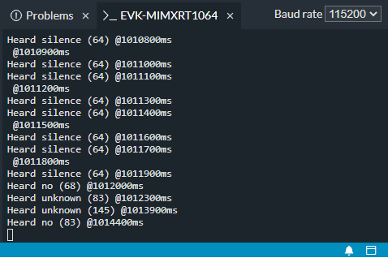

# Micro Speech Example for i.MXRT1064-EVK

This example runs a 20 kB model that can recognize 2 keywords, "yes" and "no", from speech data on the i.MXRT1064-EVK.

The application listens to its surroundings with the on-board microphone and indicates the detection of a word by lighting an LED and by displaying data on the serial console (via the DAPLink).

The source repository can be found on GitHub: [tensorflow/micro_speech](https://github.com/tensorflow/tensorflow/tree/master/tensorflow/lite/micro/examples/micro_speech)

## Deploy to NXP i.MXRT1064-EVK

The following instructions will help you build and deploy the example to the
[NXP i.MXRT1064-EVK](https://os.mbed.com/platforms/mimxrt1064-evk/)
using [Keil Studio Online](https://studio-online.mbed.com/).

1. Go to [Keil Studio Online](https://studio-online.mbed.com/).

2. Log in using your Mbed account.

3. Go to **File - Import Program...**

4. Specify the **URL** to this repository: https://github.com/ARMmbed/TensorFlow_MIMXRT1064-EVK_Microspeech.git

5. Change the **Program name** or use the auto-generated name and click **Add Program**.

6. Connect the i.MXRT1064-EVK to your computer via the J41 Micro-USB connector. The board should be recognized
   automatically by the IDE as the **Target**.

7. Use the **Play** button to build and run the program on the target.

8. Test the application by saying the two keywords.

9. Observe the output on the serial console **_EVK-MIMXRT1064**:

   
